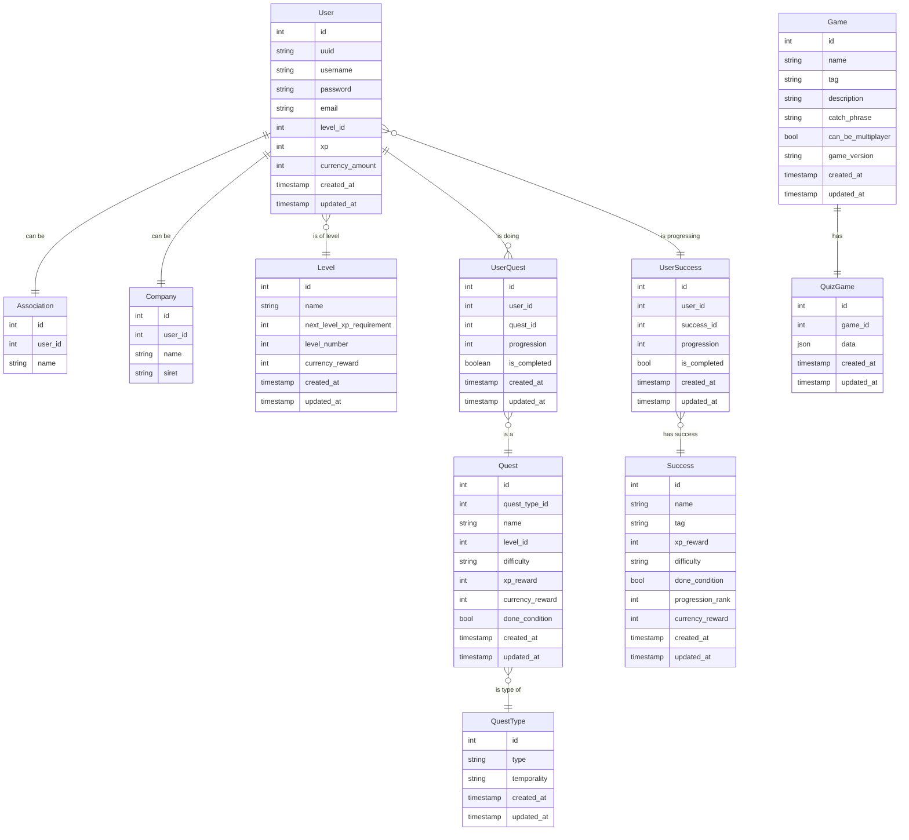

```mermaid
erDiagram
    User {
        int id
        string uuid
        string username
        string password
        string email
        int level_id
        int xp
        int currency_amount
        timestamp created_at
        timestamp updated_at
    }
    Association{
        int id
        int user_id
        string name
    }
    Company{
        int id
        int user_id
        string name
        string siret
    }
    Level {
        int id
        string name
        int next_level_xp_requirement
        int level_number
        int currency_reward
        timestamp created_at
        timestamp updated_at
    }
    UserQuest {
        int id
        int user_id
        int quest_id
        int progression
        boolean is_completed
        timestamp created_at
        timestamp updated_at
    }
    Quest {
        int id
        int quest_type_id
        string name
        int level_id
        string difficulty
        int xp_reward
        int currency_reward
        bool done_condition
        timestamp created_at
        timestamp updated_at
    }
    QuestType {
        int id
        string type
        string temporality
        timestamp created_at
        timestamp updated_at
    }
    Success{
        int id
        string name
        string tag
        int xp_reward
        string difficulty
        bool done_condition
        int progression_rank
        int currency_reward
        timestamp created_at
        timestamp updated_at
    }
    UserSuccess{
        int id
        int user_id
        int success_id
        int progression
        bool is_completed
        timestamp created_at
        timestamp updated_at
    }
    Game{
        int id
        string name
        string tag
        string description
        string catch_phrase
        bool can_be_multiplayer
        string game_version
        timestamp created_at
        timestamp updated_at
    }
    QuizGame{
        int id
        int game_id
        json data
        timestamp created_at
        timestamp updated_at
    }
    User ||--|| Association : "can be"
    User ||--|| Company : "can be"
    User }o--|| Level : "is of level"
    User ||--o{ UserQuest : "is doing"
    User }o--|| UserSuccess : "is progressing"
    UserSuccess }o--|| Success : "has success"
    UserQuest }o--|| Quest : "is a"
    Quest }o--|| QuestType : "is type of"
    Game ||--|| QuizGame : "has"

```