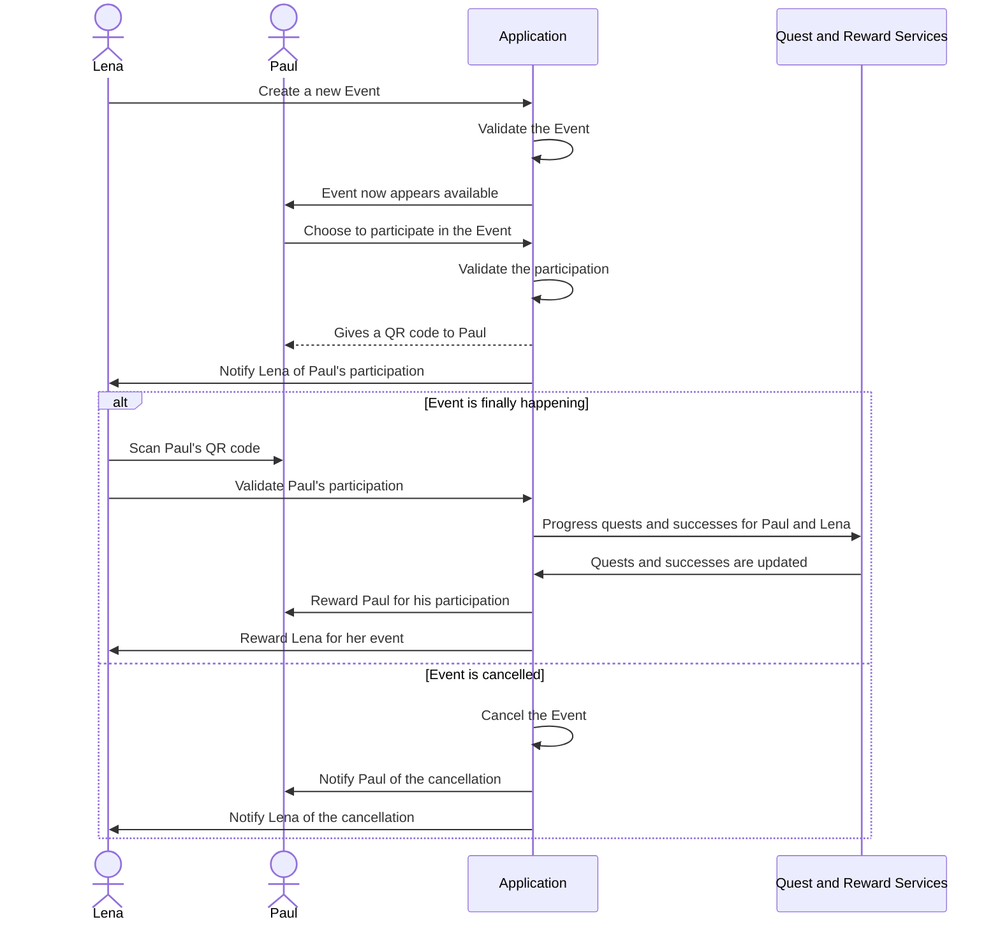

```mermaid
sequenceDiagram
    actor L as Lena
    actor P as Paul
    participant A as Application
    participant QR as Quest and Reward Services
    L ->> A: Create a new Event
    A ->> A: Validate the Event
    A ->> P: Event now appears available
    P ->> A: Choose to participate in the Event
    A ->> A: Validate the participation
    A -->> P: Gives a QR code to Paul
    A ->> L: Notify Lena of Paul's participation
    alt Event is finally happening
        L ->> P: Scan Paul's QR code
        L ->> A: Validate Paul's participation
        A ->> QR: Progress quests and successes for Paul and Lena
        QR ->> A: Quests and successes are updated
        A ->> P: Reward Paul for his participation
        A ->> L: Reward Lena for her event

    else Event is cancelled
        A->>A: Cancel the Event
        A->>P: Notify Paul of the cancellation
        A->>L: Notify Lena of the cancellation
    end
```