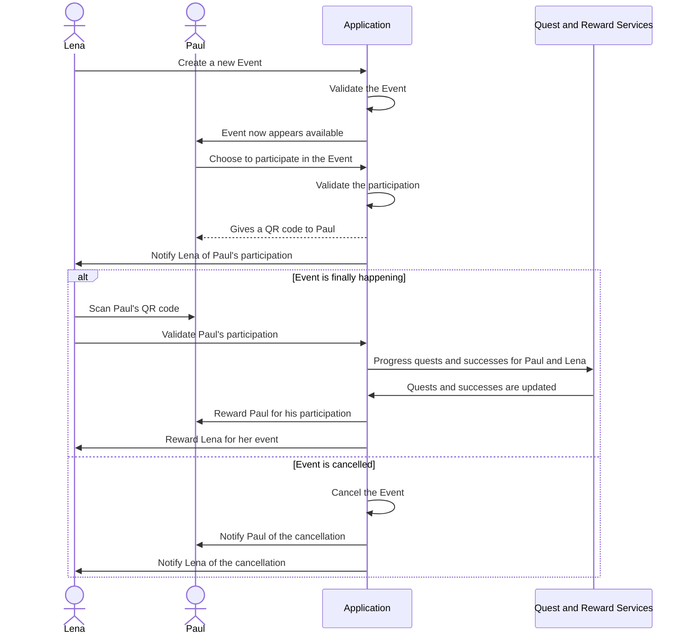
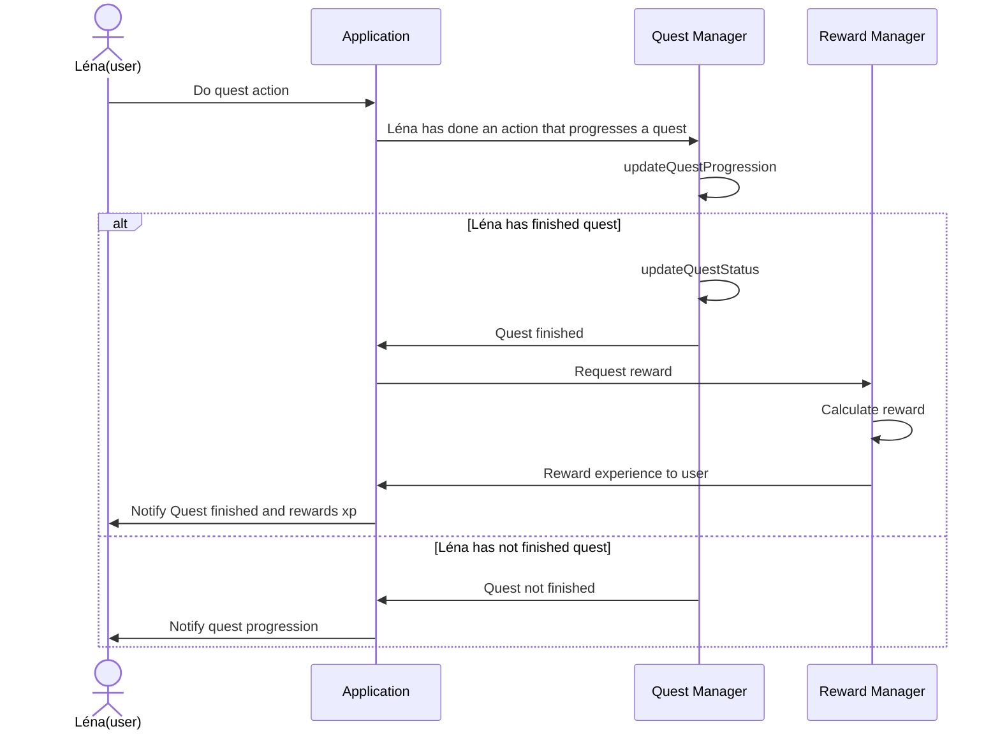
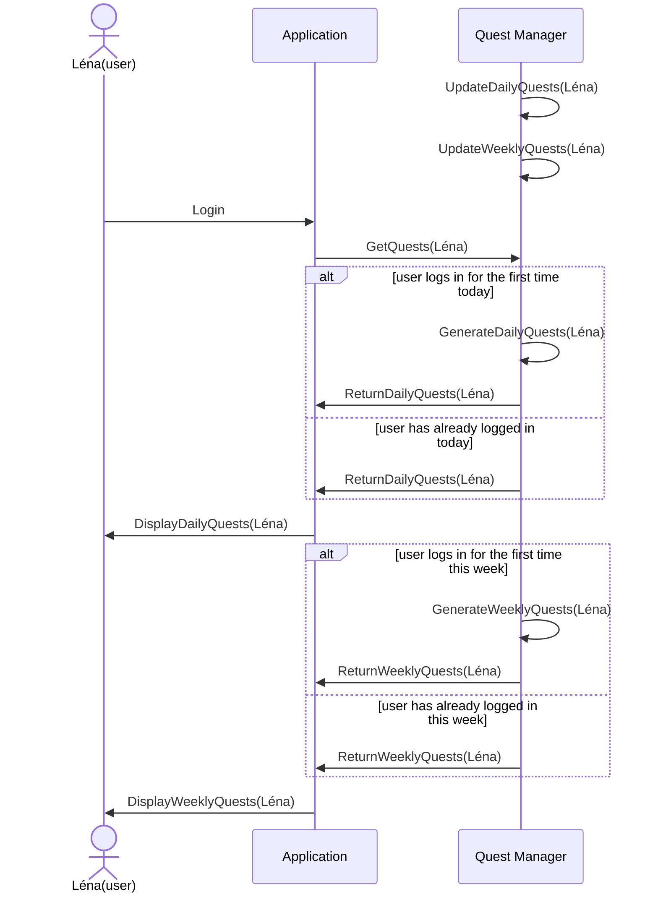
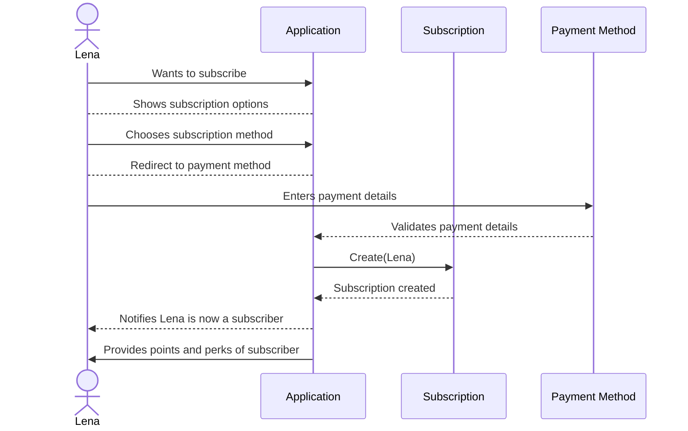
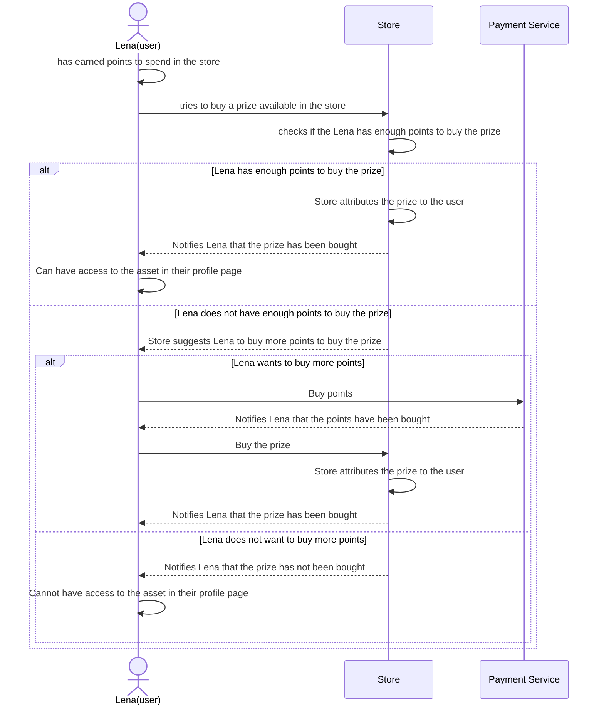

# Diagrammes de séquence
## Create and participate to an event

## Get experience points

## Play game and do quests and successes

## Quest attribution

## Subscribe and donate

## User interacts with store

